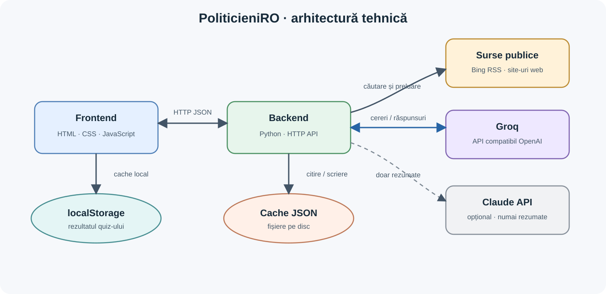

# PoliticieniRO — README tehnic

## 1. Prezentare și arhitectură

PoliticieniRO este un prototip web în limba română pentru explorarea profilurilor politicienilor și partidelor din România. Site-ul caută surse publice, extrage declarații și fragmente relevante, apoi oferă analize asistate de modele AI: orientare pe zece axe, semnalarea unor posibile erori logice, scoruri de credibilitate și rezumate. Include și un quiz de orientare politică, ale cărui rezultate se compară în browser cu profilurile disponibile.



Nu există bază de date. Rezultatele de analiză sunt memorate pe server ca fișiere JSON în `api/cache/`, iar quiz-ul salvează profilul în `localStorage` în browser. Modelele nu caută singure pe internet: backend-ul le trimite fragmentele colectate.

## 2. Stack și furnizori

- **Frontend:** HTML, CSS și JavaScript vanilla; nu există etapă de build și nu este necesar Node.js pentru rulare.
- **Backend:** Python 3.9+ și biblioteca standard. `requirements.txt` nu conține dependențe obligatorii.
- **Căutare și colectare:** Bing RSS/web și pagini publice; extragerea se face în backend.
- **Furnizor AI implicit:** Groq, prin clientul HTTP din `api/llm.py` și API-ul compatibil OpenAI. Cheia se citește din `GROQ_API_KEY` sau `api/groq_key.txt`.
- **Furnizor alternativ:** Claude API, doar pentru rezumate, dacă `SUMMARY_PROVIDER=claude`; cheia se citește din `ANTHROPIC_API_KEY`, fișierul `api/anthropic_key.txt` sau profilul local `ant auth login`.
- **Modele Groq implicite:** orientare `openai/gpt-oss-20b`; fact-check `openai/gpt-oss-120b`, `openai/gpt-oss-20b`, `qwen/qwen3.8-27b`; credibilitate `openai/gpt-oss-120b`; rezumate `qwen/qwen3.8-27b`. Modelele de rezervă și alte setări pot fi schimbate prin variabile de mediu.

Clientul Groq gestionează estimarea și ritmarea cererilor, reîncercările și trecerea la modelele de rezervă la anumite erori sau limite. Limitele furnizorului se pot schimba și depind de cont/model; verifică planul curent în Groq. Apelurile AI trimit textul surselor către furnizorul ales.

## 3. Structura proiectului

```text
politics-mvp/
├── run.ps1, run.cmd              # pornire, verificare Python și opțional instalare Python
├── serve_site.py                 # serverul HTTP pentru frontend
├── index.html                    # pagina principală
├── politician.html               # profil politician sau partid
├── compare.html                  # pagină de comparație
├── quiz.html                     # quiz de orientare
├── metodologie.html              # metodologie și parametri afișați din API
├── styles.css
├── js/
│   ├── data.js                   # politicieni, partide și zece axe
│   ├── app.js                    # randare și interacțiuni
│   ├── api.js                    # apeluri API și adaptarea rezultatelor
│   ├── quiz.js                   # quiz, generat de tools/build_quiz.py
│   ├── methodology.js            # date dinamice pentru metodologie
│   ├── orientation.js            # comparații și utilitare de orientare
│   └── scoring.js                # formule pentru scoruri
├── api/
│   ├── promise_tracker_no_ai_v2.py # HTTP API, colectare, joburi și endpoint-uri
│   ├── llm.py                    # client Groq, ritmare și retry/fallback
│   ├── orientation_llm.py         # scoruri pe zece axe
│   ├── fact_checker_api.py        # semnalarea erorilor logice
│   ├── credibility_llm.py         # scorul de credibilitate
│   ├── summarize_llm.py           # rezumate Groq sau Claude și verificări
│   ├── diskcache.py               # cache persistent JSON
│   ├── cache/                     # rezultate de demo și cache-uri generate
│   └── test_*.py                  # teste Python cu servicii/model simulate
├── tools/build_quiz.py            # regenerează js/quiz.js din sursa quiz-ului
└── test-scoring.js                # teste JavaScript pentru formule/adaptoare
```

Catalogul din `js/data.js` definește 12 politicieni și 7 partide. Valorile biografice introduse manual trebuie tratate separat de datele extrase automat; metodologia site-ului le marchează ca aproximative și neverificate.

## 4. Funcționalități și limite tehnice

- **Analiza surselor:** caută pagini și știri, descarcă pagini publice, extrage metadate, declarații, citate și fragmente despre educație/finanțare. Profilurile de demo sunt deja incluse în cache.
- **Orientare:** evaluează zece axe, de la 1 la 5, pe baza fragmentelor colectate. Dacă nu există dovezi relevante pentru o axă, aceasta rămâne fără scor. Rezultatul păstrează citatele-sursă și elimină dovezile care nu pot fi regăsite în fragmentele trimise.
- **Erori logice/fact-check:** la cerere, analizează declarații și poate compara perechi de afirmații. Rezultatul este o listă de piste, nu o verificare factuală: modelul nu are acces la internet sau la baze externe.
- **Credibilitate:** scorurile articolului folosesc fezabilitatea (`x`), precizia (`y`), istoricul (`z`) și manipularea (`w`): `0,2·x + 0,2·y + 0,4·z + 0,2·w`. Scorul politicianului agregă articolele conform implementării și metodologiei afișate în site.
- **Rezumate:** se generează la cerere din textul paginii și se verifică automat numerele, numele proprii și acronimele față de sursă. Un rezumat care nu trece verificarea este marcat pentru revizuire.
- **Quiz:** 50 de afirmații pe zece axe (20 inițiale, apoi rafinare). Răspunsurile și profilul rămân în browser; comparația se face pe axele comune disponibile.
- **Cache:** rezultatele sunt scrise în `api/cache/<tip>/` ca JSON. Nu expiră automat; cererile ulterioare folosesc rezultatele existente, iar regenerarea se cere explicit cu `refresh=1` unde este suportată. Joburile active sunt urmărite prin `/jobs/<id>`.

Scorurile AI sunt estimări și pot fi greșite sau incomplete. Rezultatele depind de ce returnează căutarea, de fragmentele extrase și de modelele disponibile. Atribuirea automată a citatelor poate fi imperfectă. Quiz-ul nu este o recomandare de vot. Consultă pagina **Metodologie** pentru definițiile, parametrii și limitele detaliate.

## 5. Rulare locală

### Cerințe

- Windows 10/11 și PowerShell pentru scriptul de pornire.
- Python 3.9+; dacă lipsește, `run.ps1` încearcă instalarea cu `winget`.
- Internet pentru căutare și surse publice.
- Cheie Groq pentru generarea analizelor noi. Rezultatele deja salvate în cache se pot consulta fără cheie.
- Node.js este opțional și folosit doar de testul JavaScript.

### Pornire

Din directorul proiectului:

```powershell
.\run.ps1
```

sau dublu-click pe `run.cmd`. Scriptul pornește API-ul la `http://127.0.0.1:8000` și site-ul la `http://localhost:8080`, apoi deschide browserul. Apasă Enter în fereastra scriptului pentru oprire.

Opțiuni utile:

```powershell
.\run.ps1 -NoWait         # pornește serverele în fundal
.\run.ps1 -Stop           # oprește procesele proiectului
.\run.ps1 -NoBrowser      # nu deschide automat browserul
.\run.ps1 -Port 9090      # schimbă portul site-ului
.\run.ps1 -SkipKeyPrompt  # sari peste solicitarea interactivă a cheii
.\run.ps1 -Test           # rulează testele automate incluse
```

Cheia Groq poate fi furnizată prin `GROQ_API_KEY` sau introdusă când o solicită scriptul. Scriptul o salvează în `api/groq_key.txt`, fișier exclus din Git prin `.gitignore`. Nu pune cheia în JavaScript, README sau într-un commit. Dacă ai nevoie de un alt port API, actualizează și `API_BASE` din `js/api.js`.

### Endpoint-uri principale

- `GET /health` — verificarea stării API-ului.
- `GET /` — lista endpoint-urilor.
- `GET /analyze?name=...` — pornește/returnează jobul de colectare și analiză a surselor.
- `GET /orientation?name=...` — jobul scorurilor pe axe.
- `GET /factcheck?name=...` — jobul de analiză a erorilor logice.
- `GET /credibility?name=...` — jobul scorului de credibilitate.
- `POST /summary` — rezumat pentru articol sau fragmente de profil.
- `GET /jobs/<id>` — starea și rezultatul unui job.
- `GET /cached`, `GET /cache` — citire și inventar cache.
- `GET /methodology` — parametrii folosiți de pagina de metodologie.

Parametrii concreți și formatul răspunsurilor sunt definiți în `api/promise_tracker_no_ai_v2.py` și `js/api.js`.

## 6. Testare și dezvoltare

Testele incluse folosesc modele/clienți simulați pentru verificări izolate și nu demonstrează calitatea căutării reale ori a rezultatelor AI. Comanda de rulare este ` .\run.ps1 -Test `; aceasta lansează testele Python și testul `test-scoring.js` dacă Node.js este disponibil. Testele nu au fost executate la actualizarea acestui document.

După modificarea sursei quiz-ului, regenerează `js/quiz.js` cu:

```powershell
python .\tools\build_quiz.py
```
